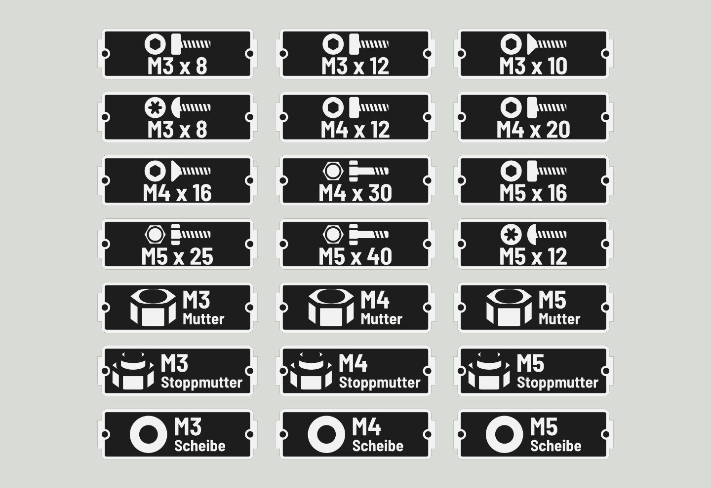

# Gridfinity-Labels

**Deutsch** | [English](#english)

Browser-Generator für bedruckte Einleger (Labels) für Gridfinity-Bins mit dem Labelhalter von Pred.
Das Label wird zweiteilig erzeugt – Grundplatte und erhabenes Relief – und kann so direkt zweifarbig gedruckt werden.

## Funktionen

- **Icons in vier Gruppen:** Antrieb (Schlitz, PH, PZ, Innensechskant, Torx, …), Kopfart (Zylinder-, Sechskant-, Senk-, Linsen-, Flach-, Flanschkopf, ohne Kopf), Gewinde / Schraubenart (Voll-, Teil-, Holz-, Blechgewinde, Bohrschraube, …) sowie Muttern und Scheiben. Kopf und Gewinde werden automatisch zu einer Schraube zusammengesetzt.
- **Text und Zusatztext** mit automatischer Größenanpassung und Warnung, wenn Schrift zu klein zum Drucken wird. Das Durchmesser-Zeichen ⌀ lässt sich per Knopf neben dem Textfeld einfügen, z. B. „Scheibe ⌀ 7“.
- **Oberfläche auf Deutsch und Englisch** (Umschalter oben rechts, beim ersten Öffnen nach Browsersprache).
- **Breiten 1× bis 5×** (Label-Länge = 42 mm × Einheiten − 4,2 mm).
- **Serien:** z. B. „M3“ mit „6, 8, 10, 12“ → vier Labels auf einmal.
- **Export:** 3MF (ein Objekt mit den Teilen „Basis“ und „Relief“) oder zwei STL-Dateien.
- Läuft komplett im Browser, keine Installation. Deine Labels werden lokal im Browser gespeichert.

## Benutzung

Öffne `index.html` im Browser (beim ersten Öffnen wird eine Internetverbindung für three.js benötigt) oder nutze die veröffentlichte GitHub-Pages-Version.

## Zweifarbig drucken (ElegooSlicer / OrcaSlicer / Bambu Studio)

1. Im Filament-Bereich ein zweites Filament anlegen (z. B. 1 = Schwarz, 2 = Weiß).
2. 3MF öffnen, in der Objektliste das Objekt aufklappen – darunter liegen die Teile „Basis“ und „Relief“ (in der englischen Oberfläche „Base“ und „Relief“).
3. Rechtsklick auf „Relief“ → Filament ändern → Filament 2.
4. Slicen. Der Farbwechsel liegt genau auf der Schichtgrenze bei 0,4 mm.

Ohne Mehrfarbsystem: einfarbig drucken oder bei 0,4 mm eine Pause zum Filamentwechsel einfügen.

Empfohlen: Schichthöhe max. 0,2 mm, Düse 0,4 mm oder kleiner.

## Maße

Gemessen an den Original-Labels von Pred: 37,8 × 12 × 0,8 mm (1×) bzw. 79,8 × 12 × 0,8 mm (2×), 0,4 mm Grundplatte + 0,4 mm Relief, Laschen 1 × 6,7 mm, Löcher Ø 1,5 mm. Alle Maße lassen sich im Generator unter „Maße und Druck“ anpassen.

Passende Bins: [Gridfinity Bin with Printable Label by Pred](https://www.printables.com/model/592545-gridfinity-bin-with-printable-label-by-pred-parame) und der Remix [mit extra Margins von Hideout Hobbyist](https://www.printables.com/model/1264115-gridfinity-bin-with-printable-label-by-pred-parame).

## Auf GitHub Pages veröffentlichen

1. Neues Repository anlegen und den Inhalt dieses Ordners hochladen.
2. *Settings → Pages → Build and deployment*: Source „Deploy from a branch“, Branch `main`, Ordner `/ (root)`.
3. Nach ein bis zwei Minuten läuft der Generator unter `https://<benutzername>.github.io/<repository>/`.

## Lizenz

Code: MIT, siehe [LICENSE](LICENSE). Eingebettete Schriften: SIL Open Font License 1.1, siehe [THIRD_PARTY_NOTICES.md](THIRD_PARTY_NOTICES.md).

---

# Gridfinity Labels (English)

Browser-based generator for printable label inserts for Gridfinity bins with Pred's label holder.
Each label is generated in two parts – base plate and raised relief – ready for two-colour printing.

## Features

- **Icons in four groups:** drive (slot, PH, PZ, hex socket, Torx, …), head type (socket cap, hex, countersunk, button, pan, flange, headless), thread / screw type (full, partial, wood, sheet metal, self-drilling, …) plus nuts and washers. Head and thread are combined into one screw icon automatically.
- **Main and secondary text** with automatic sizing and a warning when text gets too small to print. The diameter sign ⌀ can be inserted with the button next to the text field, e.g. "Washer ⌀ 7".
- **User interface in English and German** (switch at the top right; the first visit follows your browser language).
- **Widths 1× to 5×** (label length = 42 mm × units − 4.2 mm).
- **Series:** e.g. "M3" with "6, 8, 10, 12" creates four labels at once.
- **Export:** 3MF (one object with the parts "Base" and "Relief") or two STL files.
- Runs entirely in the browser. Labels are stored locally in your browser.

## Two-colour printing (ElegooSlicer / OrcaSlicer / Bambu Studio)

1. Add a second filament (e.g. 1 = black, 2 = white).
2. Open the 3MF and expand the object in the object list – it contains the parts "Base" and "Relief" ("Basis"/"Relief" when exported from the German interface, as in the example file).
3. Right-click "Relief" → Change filament → filament 2.
4. Slice. The colour change sits exactly on the layer boundary at 0.4 mm.

Recommended: max. 0.2 mm layer height, 0.4 mm nozzle or smaller.

## Dimensions

Measured from Pred's original labels: 37.8 × 12 × 0.8 mm (1×) and 79.8 × 12 × 0.8 mm (2×). All dimensions can be adjusted in the generator.

Matching bins: [Gridfinity Bin with Printable Label by Pred](https://www.printables.com/model/592545-gridfinity-bin-with-printable-label-by-pred-parame) and the [remix by Hideout Hobbyist](https://www.printables.com/model/1264115-gridfinity-bin-with-printable-label-by-pred-parame).

## Publishing on GitHub Pages

1. Create a new repository and upload the contents of this folder.
2. *Settings → Pages → Build and deployment*: source "Deploy from a branch", branch `main`, folder `/ (root)`.
3. After a minute or two the generator is live at `https://<username>.github.io/<repository>/`.

## License

Code: MIT, see [LICENSE](LICENSE). Embedded fonts: SIL Open Font License 1.1, see [THIRD_PARTY_NOTICES.md](THIRD_PARTY_NOTICES.md).
